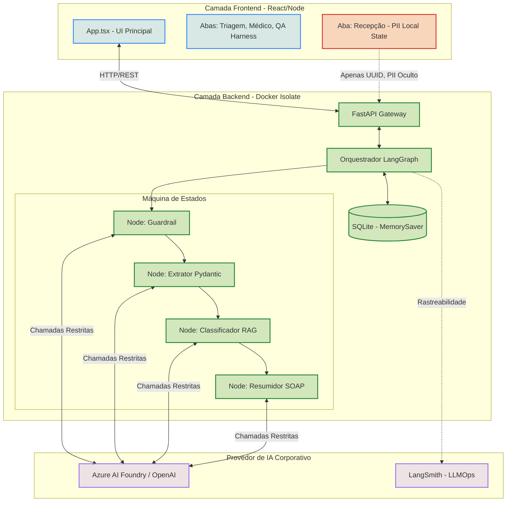

# Documento de Arquitetura e Governança B2B (VeriTriage AI)

Este documento define a arquitetura técnica, os limites de rede (Sandboxing) e os critérios de aceitação rigorosos para soluções que englobam Inteligência Artificial Generativa.

## 1. Topologia da Arquitetura e Sandboxing de IA

A arquitetura do VeriTriage foi desenhada garantindo a segregação de responsabilidades e isolamento de redes usando o **Privacy by Design**.

### 1.1 Isolamento de Rede (Docker Profiles)
A infraestrutura roda sobre Docker Compose usando a flag `api-prod`. O container não publica as portas publicamente. Ele é exposto internamente apenas na rede `veritriage_internal`. A IA opera dentro dessa "caixa de areia" (sandbox) não podendo ser acessada ou executada fora do proxy oficial.

## 2. Tratamento de LGPD e PII
- **Fronteira 1**: Nenhum dado sensível (Nome Completo, CPF) sai do Frontend. Eles existem puramente no estado local do React (React State).
- **Fronteira 2**: O backend recebe apenas textos anônimos e um UUID de sessão (`thread_id`).
- O LLM Provedor, sendo uma entidade terceira, não tem rastreabilidade para identificar o paciente. 

## 3. Critérios de Aceitação de IA (QA Harness)

Antes de qualquer branch de IA ser aceita (Merge Request), os seguintes "Quality Gates" automatizados devem ser passados com métricas determinísticas e não com avaliação subjetiva.

1. **Gate de Segurança (Prompt Injection)**
   - Ao injetar comandos maliciosos no teste, o Grafo deve falhar imediatamente na raiz com código `403 Forbidden` sem processar os dados em outros nós.
2. **Gate de Contrato Pydantic (Spec-Driven Development)**
   - O LLM **deve** usar a funcionalidade de *Structured Outputs* (ex: Function Calling) e os dados devem respeitar os enums e tipos numéricos do Schema antes da execução avançar.
3. **Gate de Acurácia QA (Deterministic Feedback)**
   - O pipeline roda via endpoint `/triage/eval-harness` testando dezenas de cenários (ex: Suspeita de IAM).
   - O risco retornado pela IA (`predicted_risk`) deve ter "Exact Match" com o risco documentado (`expected_risk`). Tolerância exigida: >95% de exatidão determinística.

## 4. Multi-Cloud Resiliência
Através da fábrica em `src/core/llm.py`, o modelo tem fallback automático. Priorizamos o ecossistema corporativo restrito (`AZURE_OPENAI_API_KEY`), mas com fallback de redundância em caso de falhas na região (Multi-cloud design).
